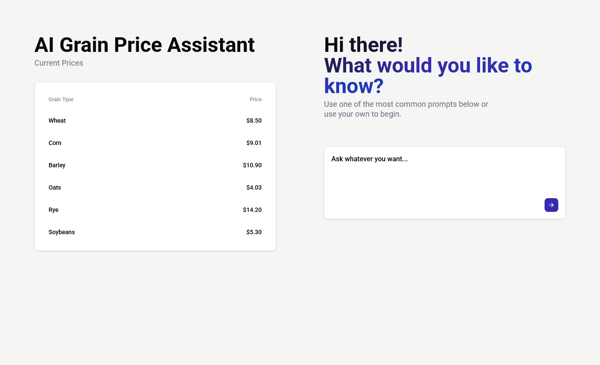

# 🌾 GrainFox Demo

A full-stack grain marketing assistant featuring real-time AI chat and price tracking — built to demonstrate skills aligned with GrainFox's tech stack.



## ✨ Highlights

- **Real-time AI Chat** — WebSocket-powered conversations with context memory
- **LangChain + Gemini** — Production-ready AI integration with custom prompts
- **Grain Price Dashboard** — REST API with Django REST Framework
- **Fully Dockerized** — One command to run the entire stack

## 🛠 Tech Stack

| Category | Technologies |
|----------|--------------|
| Backend | Python, Django, Django REST Framework, Channels |
| Frontend | React, TypeScript, TailwindCSS |
| AI/ML | LangChain, Google Gemini |
| DevOps | Docker, Docker Compose |

## 🚀 Quick Start

```bash
git clone https://github.com/ericmignardi/grainfox-demo.git
cd grainfox-demo
cp .env.example .env  # Add your GEMINI_API_KEY
docker compose up --build
```

Open **http://localhost** to view the app.

## 📁 Project Structure

```
├── backend/         # Django API + WebSocket consumers
├── frontend/        # React TypeScript app
└── compose.yml      # Docker orchestration
```

## 🧪 Running Tests

```bash
docker exec grain-backend python manage.py test
```

## 👤 Author

**Eric Mignardi** — [GitHub](https://github.com/ericmignardi) | [LinkedIn](https://linkedin.com/in/ericmignardi)
